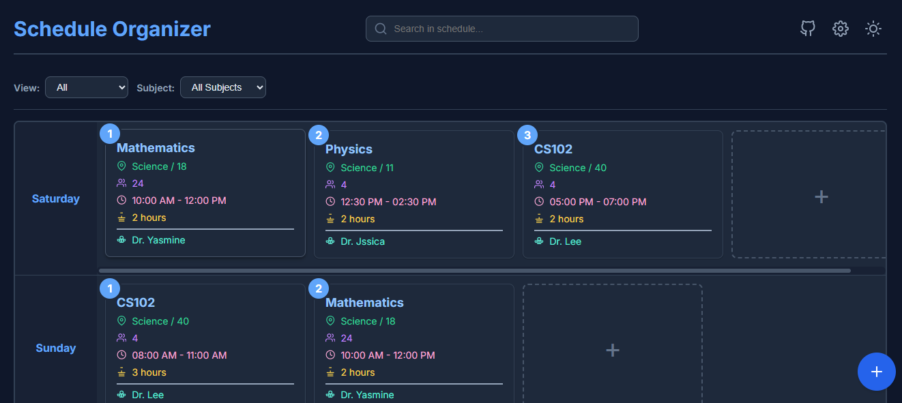

# 🗓️ Schedule Organizer Pro

A polished, single-page **web application** for managing weekly schedules — built from the ground up with **HTML5**, **CSS3 (Flexbox & Grid)** and **Vanilla JavaScript (ES6+)**. Clean UI, bilingual support (English / Arabic), local persistence, import/export and a set of thoughtful micro-interactions make this a reliable personal timetable tool.

---

## 📸 Project Preview


---

## 🌐 Live Demo
https://moh-alfarjani.github.io/schedule-organizer-pro/

---

## 🚀 Project Overview
**Schedule Organizer Pro** is designed to let students and staff create, view, edit and manage weekly lectures or events without any server — everything runs in the browser and persists to `localStorage`. The app focuses on clarity and speed: a vertical list of days, horizontal scrollable lecture cards per day, quick add/edit modals, filters, search, and a floating action button (FAB) for common operations.

Key user capabilities:
- Create, view, edit and delete lectures (full CRUD) via modals.
- Persistent state using `localStorage` so schedules remain between sessions.
- Import and export schedules as JSON backups (with confirmation dialogs).
- Real-time search, day/subject filters and autocomplete suggestions when filling forms.
- Dark / light theme toggle and quick language switch (English ⇄ Arabic).

---

## 📅 Development Plan (As Implemented)
| Day | Focus                      | Outcome |
|-----|----------------------------|---------|
| 1   | Project scaffold & wireframe | `index.html`, `style.css` and basic grid created. |
| 2   | Core layout                 | Responsive day rows + horizontal lecture containers. |
| 3   | CRUD & Modals               | Add / View / Edit modal flows implemented in `main.js`. |
| 4   | State & Persistence         | Central `state` object + `localStorage` sync and normalisation. |
| 5   | i18n & Theming              | English/Arabic translations and theme variables (CSS). |
| 6   | Extras                      | Import/Export, FAB, autocomplete, countdown timers. |
| 7   | Testing & polish            | Accessibility tweaks, focus handling, keyboard-friendly forms. |

---

## 🗂️ Project Structure
```
Schedule-Organizer-Pro/
├── index.html                 # Main UI and modal markup.
├── README.md                  # (This file)
├── main.png                   # Preview image used in README.
├── style.css                  # Full styling, variables for theme, responsive rules.
└── main.js                    # App logic: state, rendering, i18n, import/export, modals.
```

---

## 🛠️ Technologies & Tools
- **HTML5** — semantic structure and accessible modals.
- **CSS3** — Flexbox & Grid layouts, CSS custom properties for theming, responsive rules and animations.
- **Vanilla JavaScript (ES6+)** — IIFE-wrapped app, single `state` object, DOM rendering and event handling.
- **Browser APIs** — `localStorage`, `FileReader` for import/export, and standard form APIs.

---

## 🔍 Features (Detailed)
### Core
- **Full CRUD** for lectures: add new lecture cards, view details, edit inline via modal and remove with confirmation.
- **Persistent state:** full schedule + settings saved to `localStorage`.
- **Import / Export JSON:** export a backup (`schedule_backup_YYYY-MM-DD.json`) and import with validation and confirm-replace modal.

### Productivity & UX
- **Search & Filters:** live search across cards; filter by day status (All / Filled / Empty) and by Subject.
- **Autocomplete:** suggestions for Subjects, Lecturers, Colleges, Halls and Groups derived from existing entries.
- **Countdown Timers:** per-lecture countdowns / status badges (safe / soon / urgent / in-progress).
- **Drag & Drop (cards are draggable):** lecture cards set as draggable to support moving/reordering (UI prepared for drag interactions).
- **FAB (Floating Action Button):** quick access to import / export / language actions.
- **Theming:** light / dark toggle implemented via CSS custom properties.
- **Bilingual UI (EN / AR):** built-in translation object and runtime switching.

---

## ✅ How To Run (Local)
1. Clone the repository:
   ```bash
   git clone https://github.com/moh-alfarjani/schedule-organizer-pro.git
   cd schedule-organizer-pro
   ```
2. Open the app:
   - Double-click `index.html` to open in your browser **or**
   - Serve via a local HTTP server (recommended for full file input functionality):
     ```bash
     # Python 3
     python -m http.server 8000
     # then open http://localhost:8000
     ```
3. The interface is ready — all data is stored locally in your browser.

---

## 📖 Usage (Quick Guide)
- **Add a lecture:** Click the `+` card in any day row → fill the form → Save. Required field: **Subject**.
- **View details:** Click any lecture card to open a detail modal with all info and options (Copy, Edit, Delete).
- **Edit:** In the details modal, click **Edit** to switch to form mode; use Enter to navigate fields; save to apply.
- **Delete:** Delete is protected by a confirmation dialog.
- **Import / Export:** Use the FAB to import a `.json` backup or open the Export modal to generate a backup file. Imports show a confirmation with lecture count before replacing current data.

---

## ⚙️ Settings & Data Management
Open Settings via the gear icon to:
- Change the application title (English & Arabic).
- Manage autocomplete lists (Subjects, Lecturers, Colleges, Halls, Groups) — add/remove entries used across the UI.

---

## Accessibility & Keyboard Notes
- The forms support keyboard navigation; pressing **Enter** moves to the next input and submits on the last field.
- Modals use clear controls and focusable buttons; close them with the provided close buttons or by clicking outside.

---

## Contributing
Contributions, improvements and bug fixes are welcome. Suggested workflow:
1. Fork the repository.  
2. Create a feature branch: `git checkout -b feat/my-change`.  
3. Commit changes with clear messages.  
4. Open a Pull Request describing your change.

If you add features, please keep them framework-free (Vanilla JS + CSS) to remain consistent with the project's learning goals.

---

## Licence
This project is released under the **MIT Licence** — feel free to use, adapt and share. (Add a `LICENSE` file with the MIT text when you publish.)

---

## Troubleshooting
- **Import fails / “Invalid file format”:** Ensure the JSON backup has a top-level `schedule` object and `settings` (exported using the app). The app validates and will show a friendly error if the file is malformed.
- **Export disabled:** If there are no lectures, the export action is disabled and the UI will prompt you that there’s nothing to export.

---

## Notes For Maintainers (Technical)
- The JS is wrapped in an IIFE to avoid polluting the global scope; the canonical days order is: `['saturday','sunday','monday','tuesday','wednesday','thursday','friday']`. State normalisation protects against malformed imports.
- Styles are driven by CSS variables so new theme colours or tweaks are straightforward.

---

## Contact & Follow
- GitHub Repo: `github.com/moh-alfarjani/schedule-organizer-pro`  
- GitHub Profile: `github.com/moh-alfarjani`  

---

## 🌐 Find & Follow Me
- GitHub Repo: [github.com/moh-alfarjani/FlixFilmBox](https://github.com/moh-alfarjani/FlixFilmBox)  
- GitHub Profile: [github.com/moh-alfarjani](https://github.com/moh-alfarjani)  
- Facebook Page: [facebook.com/mohalfarjani](https://facebook.com/mohalfarjani)  
- LinkedIn: [linkedin.com/in/moh-alfarjani](https://www.linkedin.com/in/moh-alfarjani/)

---

#Tags / Keywords
#ScheduleOrganizer #ScheduleOrganizerPro #ScheduleApp #TimetableApp #StudyPlanner #WeeklyPlanner #CourseScheduler #LectureManager #TaskManager #StudentTools #AcademicTools #TimeManagement #ProductivityApp #CRUDApp #VanillaJS #JavaScriptApp #HTML5 #CSS3 #CSSFlexbox #CSSGrid #ResponsiveDesign #SinglePageApp #SPA #LocalStorage #WebStorage #DataPersistence #ImportExport #JSONHandling #CountdownTimer #DarkMode #LightMode #ThemeSwitcher #CustomProperties #CSSVariables #MicroInteractions #ModalUI #FAB #FloatingActionButton #Autocomplete #SearchFilter #DragAndDrop #BilingualUI #Multilingual #i18n #RTLDesign #ArabicSupport #EnglishSupport #UIUXDesign #FrontendDevelopment #NoFramework #FrameworkFree #VanillaJavaScript #StateManagement #CleanCode #ModernWebApp #UniversityProject #StudentProject #OpenSource
